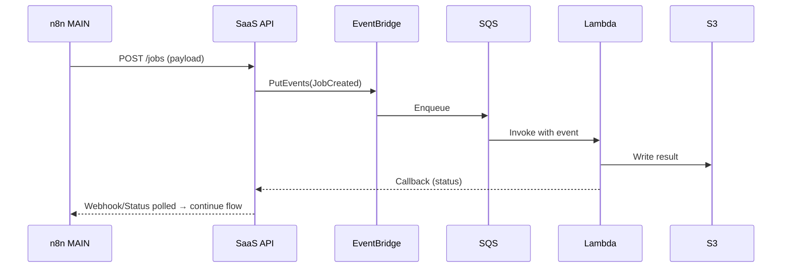

# LeverageAgent — Portable Orchestration & AI SaaS Stack (Edge → Cloud)

**Goal:** Run everything on your laptop(s) today and lift‑and‑shift the same stack to cloud (AWS or similar) later — with minimal changes.

**Core pieces**

* **n8n (orchestrator)** in **queue mode**: one `MAIN` + any number of `WORKER`s
* **SaaS API** (FastAPI skeleton) for LangChain/LangGraph or any service endpoints
* **Event‑driven workflows**: locally via n8n timers/webhooks; in cloud via AWS (EventBridge/SQS/Lambda)
* **Stateful services**: Postgres, Redis, S3‑compatible object storage, Vector DB (Qdrant)
* **Traefik** as reverse proxy & router (so everything lives behind a single entrypoint)

> Use this README with the `infra/` folder (Compose files, Makefile, example services). You can run on a heavy laptop 24/7 and still open a light laptop to run workers on the same stack.

---

## 0) Repository layout (suggested)

```
LeverageAgent/
├─ infra/
│  ├─ docker/
│  │  ├─ compose.edge.yml        # laptop dev (Traefik+PG+Redis+Qdrant+MinIO+n8n+API)
│  │  └─ compose.cloud.yml       # cloud profile (managed DB/cache/S3)
│  ├─ services/
│  │  └─ langgraph-api/
│  │     ├─ Dockerfile
│  │     ├─ requirements.txt
│  │     └─ app/main.py          # FastAPI skeleton (extend with your logic)
│  ├─ scripts/
│  │  ├─ backup.sh               # n8n export workflows + credentials
│  │  └─ restore.sh              # n8n import workflows + credentials
│  ├─ .env.example
│  └─ Makefile
├─ apps/                          # future product apps (web, CLI, batch, etc.)
├─ workflows/                     # exported n8n .json (versioned in Git)
└─ README.md                      # this file
```

---

## 1) Architecture overview

### 1.1 Logical components

* **Traefik** → routes `n8n.<domain>` and `api.<domain>` to containers (no random exposed ports).
* **n8n MAIN** → owns schedules & webhooks; **n8n WORKER(s)** → execute jobs in parallel.
* **SaaS API (FastAPI)** → your endpoints for AI tasks, long‑running jobs, or orchestration helpers.
* **Postgres** → n8n config, credentials, executions.
* **Redis** → n8n job queue (BullMQ).
* **Object storage** → MinIO locally, S3/R2 in cloud.
* **Vector DB** → Qdrant for embeddings.

### 1.2 Two‑laptop mode (edge)

* **Heavy laptop**: runs Traefik + Postgres + Redis + Qdrant + MinIO + `n8n MAIN` + `n8n WORKER` + API.
* **Light laptop**: runs only **`n8n WORKER`** (default). *Emergency only:* can run a temporary `MAIN` **iff** heavy `MAIN` is off.

> **One MAIN rule:** never run two MAINs at the same time.

### 1.3 Event‑driven (cloud)

* Use **EventBridge** rules → **SQS** → **Lambda** for reactive compute.
* n8n triggers & webhooks call your API or publish to SQS; results land in S3/Qdrant; n8n polls/checks status and continues.

Mermaid (high‑level):

```mermaid
flowchart LR
  A[Client/Webhook] -->|HTTPS| T[Traefik]
  T -->|/n8n| N8[N8N MAIN]
  T -->|/api| API[FastAPI SaaS]
  N8 <-->|jobs| R[(Redis)]
  N8 -->|state| PG[(Postgres)]
  API -->|objects| S3[(S3/MinIO)]
  API -->|vectors| QD[(Qdrant)]
  subgraph Cloud (later)
    EV(EventBridge) --> SQS
    SQS --> L[Lambda]
    L --> S3
    L --> API
  end
```

---

## 2) Local deployment (edge)

**Prereqs:** Docker Desktop/Engine, `make` (optional), ports 80 and 9001 free.

```bash
cd infra
cp .env.example .env
# generate once and paste into N8N_ENCRYPTION_KEY
openssl rand -hex 32

# start everything
make edge

# open UIs
http://n8n.localhost          # n8n editor
http://api.localhost/health   # FastAPI hello
http://minio.localhost        # MinIO console (use creds from .env)
```

**Backups (Community Edition):**

```bash
./scripts/backup.sh                         # exports to backups/<ts>/
# commit backups to Git if you want versioning of workflows/credentials
./scripts/restore.sh backups/<timestamp>
```

**Need a public URL for webhooks while traveling?**

* Quick: `cloudflared tunnel --url http://localhost:80`
* Persistent: create a named tunnel and map `n8n.<domain>` → Traefik. (See `docker/cloudflared/config.yml` template.)

---

## 3) Cloud deployment (AWS example)

### 3.1 Choose your path

* **Simple/fast:** 1x EC2 (or Lightsail) VM running `compose.cloud.yml` behind a security group + DNS → good for early stage.
* **Serverless/managed:** ECS on Fargate or EKS; managed **RDS (Postgres)**, **ElastiCache (Redis)**, **S3**, **EventBridge/SQS/Lambda**.

### 3.2 Minimal steps (EC2 + managed DB/cache)

1. **Create** RDS Postgres, ElastiCache Redis, S3 bucket; note endpoints.
2. **Provision** 1x EC2 (Ubuntu), install Docker & Compose.
3. **Clone** repo to EC2 and create `.env` from `.env.example`:

   * Set `POSTGRES_*` to RDS
   * Set `REDIS_*` to ElastiCache
   * Set `S3_*` to S3 (endpoint blank or AWS SDK default)
   * Set `PUBLIC_DOMAIN`, `WEBHOOK_URL`, and **re‑use** your `N8N_ENCRYPTION_KEY`
4. **Run**: `docker compose -f docker/compose.cloud.yml --env-file .env up -d`
5. **Point DNS**: `n8n.<domain>` and `api.<domain>` to your instance (or ALB). Terminate TLS at Traefik or behind Cloudflare.

### 3.3 ECS/Fargate (outline)

* **Images** → push `langgraph-api` and any custom services to **ECR**.
* **Traefik** → run as a service on Fargate with ALB in front (or use ALB path‑based routing directly and drop Traefik).
* **n8n** → 1 service as `MAIN`, 1+ services as `WORKER` tasks, all pointing to RDS/ElastiCache.
* **Secrets** → store in SSM Parameter Store/Secrets Manager; inject as env.
* **Webhooks** → `WEBHOOK_URL` points to your public ALB/Cloudflare domain.

### 3.4 Event‑driven with Lambda

* Publish events from n8n/API to **EventBridge**.
* EventBridge rule → **SQS** → **Lambda** (container image or zip) for scalable compute.
* Lambda writes artifacts to S3/Qdrant; n8n monitors job status (polling or callback webhook) and proceeds.

Sequence (Mermaid):



---

## 4) Configuration & secrets

**`.env` keys (dev defaults in `.env.example`)**

```
# URLs
PUBLIC_DOMAIN=automation.local
WEBHOOK_URL=https://n8n.your-domain.tld

# n8n
N8N_ENCRYPTION_KEY=<generate-once-and-reuse>

# Postgres/Redis
POSTGRES_HOST=postgres        # or RDS endpoint in cloud
POSTGRES_DB=leverage
POSTGRES_USER=postgres
POSTGRES_PASSWORD=postgres
REDIS_HOST=redis              # or ElastiCache endpoint

# Object storage (MinIO locally → S3 in cloud)
S3_ENDPOINT=http://minio:9000 # clear for real AWS S3
S3_ACCESS_KEY=minioadmin      # use IAM in cloud
S3_SECRET_KEY=minioadmin
S3_BUCKET=leverage-bucket
S3_USE_SSL=false
```

**Rules**

* **Keep the same `N8N_ENCRYPTION_KEY`** across machines/environments.
* Only one `n8n-main` at a time.
* n8n workers can run on any machine/VM; they just need Redis & Postgres connectivity.

---

## 5) Development loops

**SaaS API (FastAPI skeleton)**

```bash
# build and restart API
make build-api
# it’s routed at http://api.<domain>/health
```

Extend `app/main.py` with your endpoints (e.g., /ingest, /analyze, /optimize). Use boto3 for S3, qdrant-client for vectors.

**Workflows**

* Design flows in n8n. Store canonical exports in `workflows/` via `./scripts/backup.sh`.
* Treat workflows as code: PRs, code review, environments, rollbacks.

---

## 6) CI/CD (images & deploy)

**Build & push images**

```bash
docker build -t YOURUSER/leverage-langgraph:0.1.0 ./infra/services/langgraph-api
# multi‑arch push
docker buildx build --platform linux/amd64,linux/arm64 \
  -t YOURUSER/leverage-langgraph:0.1.0 --push ./infra/services/langgraph-api
```

**AWS ECR** (example)

```bash
aws ecr create-repository --repository-name leverage-langgraph
aws ecr get-login-password | docker login --username AWS --password-stdin <ACCOUNT>.dkr.ecr.<REGION>.amazonaws.com

docker tag YOURUSER/leverage-langgraph:0.1.0 <ACCOUNT>.dkr.ecr.<REGION>.amazonaws.com/leverage-langgraph:0.1.0
docker push <ACCOUNT>.dkr.ecr.<REGION>.amazonaws.com/leverage-langgraph:0.1.0
```

**Zero‑downtime**

* ECS: set desired count > 1 for workers; rolling update on API; keep only 1 MAIN task for n8n.
* EC2 + Compose: run `docker compose pull && docker compose up -d` behind Traefik.

---

## 7) Observability (add when needed)

* **Logs:** Loki + Promtail (Docker driver) or CloudWatch Logs in ECS.
* **Metrics:** Prometheus + Grafana; or CloudWatch metrics for infra.
* **Tracing:** OpenTelemetry collector sidecar → vendor (optional).

---

## 8) Security checklist

* Rotate all default creds; use IAM for S3 in cloud.
* Restrict DB/Redis by SG/VPC; never expose Redis to internet.
* Terminate TLS (Traefik with Let’s Encrypt or Cloudflare proxy).
* Secrets in SSM/Secrets Manager (cloud) instead of .env files.

---

## 9) Frequently asked

**Do I need a tunnel?** Only if you require public webhooks while on a laptop. Otherwise skip.

**Why Traefik?** Simple Docker label routing, one 80/443 entry, and easy to move to cloud.

**Can I scale compute?** Add n8n workers, or push async jobs to SQS→Lambda/ECS tasks for heavy workloads.

**Where do files go?** Use S3/MinIO via the SaaS API; reference object keys in n8n.

---

## 10) Roadmap (suggested)

* Add GitHub Actions for image builds (Docker Hub/ECR) + deploy.
* Add Loki/Promtail + Grafana dashboard.
* Add Terraform or CDK stacks for RDS/ElastiCache/ECS wiring.
* Add Step Functions for multi‑step ML pipelines (optional).

---

## 11) Quick commands

```bash
# Edge up/down
make edge\ nmake edge-down

# Cloud up/down
make cloud\ nmake cloud-down

# Logs
make logs

# Backups
./scripts/backup.sh
./scripts/restore.sh backups/<timestamp>
```

> Tip: Keep `workflows/` exported and versioned. Your infra is portable because state lives in managed services and files live in object storage.
